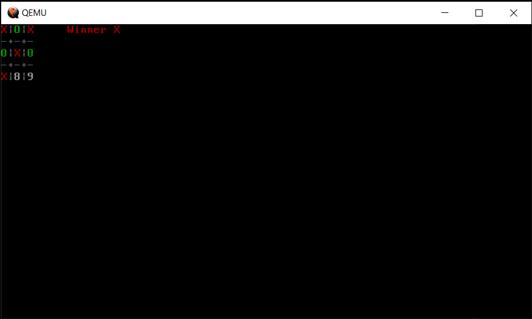

# Tic-Tac-Toe in the boot sector

Example TTT game implementation in the boot sector.
Play with keys 1-9
Written in NASM (https://www.nasm.us/).
To build it you will need nasm and qemu for x86. On ubuntu do `sudo apt-get install nasm qemu`

to buid run: `make` to play: `make boot`
